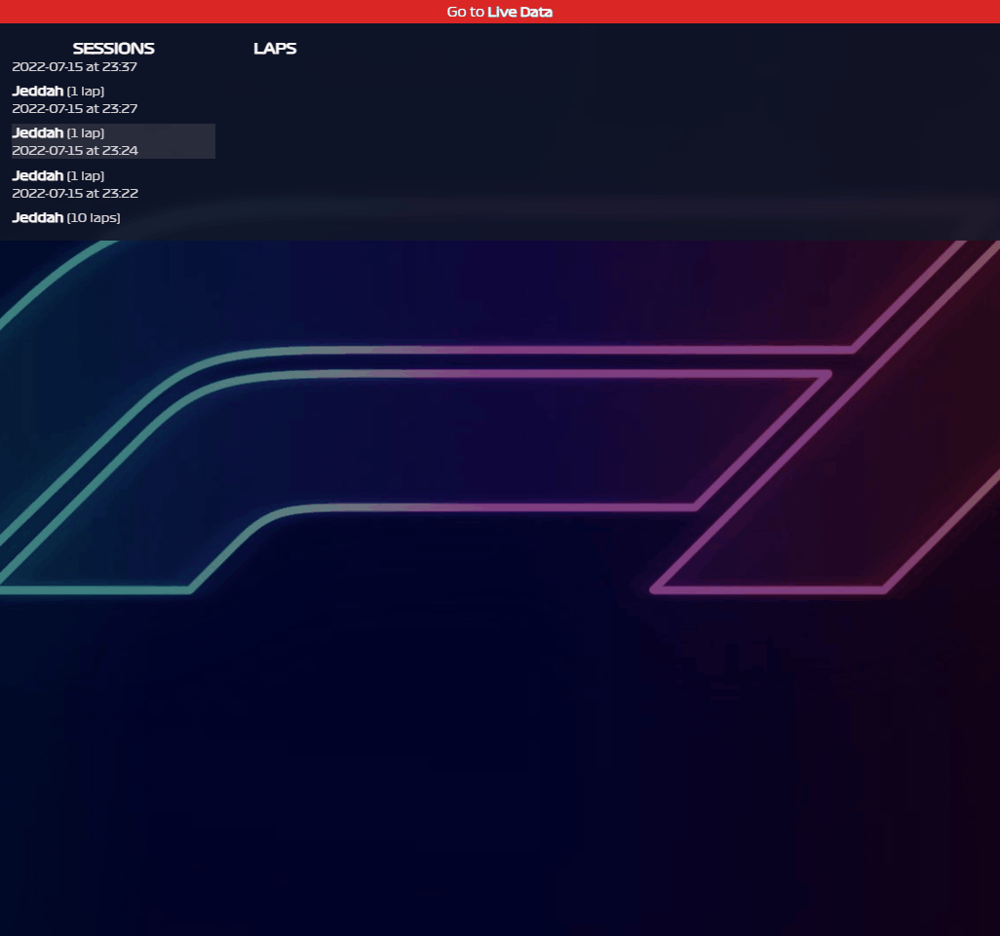
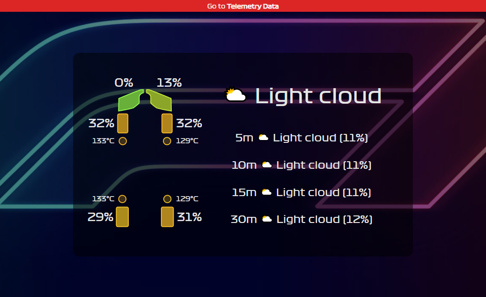

# F1 Telemetry Data Collector

This Python application uses InfluxDB to collect telemetry data from the
official F1 game.

    

It is also possible to display live session and car data.

    

## Installation

The application requires Python >= 3.8 to work.

~~~
pip install pipx
pipx install f1-telemetry
~~~

## Usage

Ensure that InfluxDB is running with at least an Org and an access token, and
configured with an `f1-telemetry` bucket.

~~~
f1-tel <org> <token>
~~~

This also serves a very basic web application for telemetry and live data
visualisations. With InfluxDB still running, navigate to
`http://localhost:20776/index.html` page in the browser with the `org` and
`token` parameters, e.g.

~~~
http://localhost:20776/index.html?org=P403n1x87&token=NLyjW4ml8XuTPTwCbtC5PC1Z-JJ6lwjAm7B1-ScM_XP9N_eoCkIGTmm3wHrC92cQVsMmKofgqbx6PM-ZZgVQKw==
~~~

> **NOTE**: The application can run without InfluxDB. In this case, no telemetry
> data will be stored. If you are using this tool without a running instance of
> InfluxDB, the `<org>` and `<token>` arguments must still be provided, but they
> can be random values, e.g.
> ~~~
> f1-tel no influxdb
> ~~~

## Additional Features

### TT Rival Data

When collecting data from Time Trials and competing against a rival, some of
the rival's car data is also collected, like throttle, brake, speed, and gears,
for comparison.

### Reporting

After sessions like Qualifying and Race, the final classification data can be
collected in CSV reports by passing the `-r`,`--report` option from the command
line. The files are generated in the current working directory. The collected
data can be useful for league coordinators.
